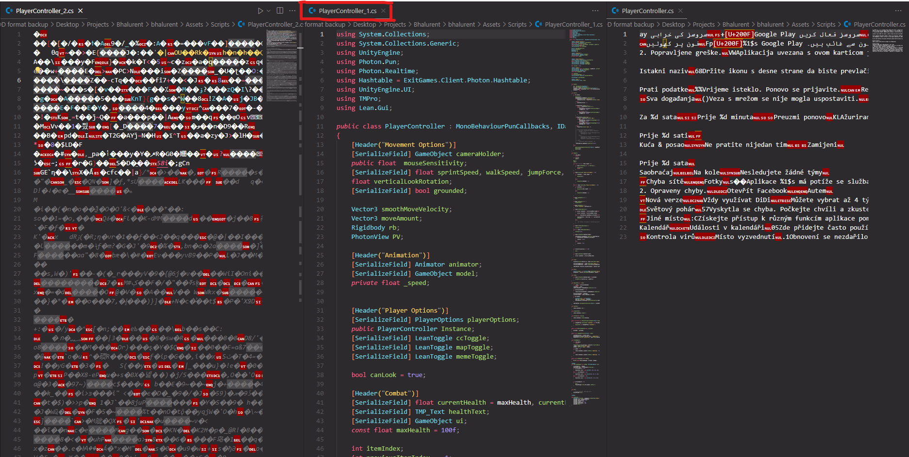
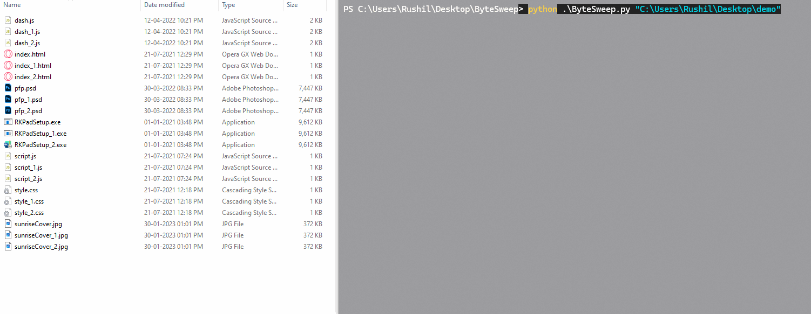

# ByteSweep
**ByteSweep** is a lightweight command-line Python utility designed to detect and remove **corrupted** or **redundant duplicate files** in a directory — particularly useful for post-data recovery cleanup.

## Features
- Detects **corrupt or invalid files** based on:
  - Binary file headers
  - UTF-8 decodability
- Detects and removes **redundant duplicates** of the same file type
- Supports a *wide* range of file types
- Automatically **renames** files back to their correct names pre-duplication
- Walks through the given directory **recursively**, making sure every file and subfolder is processed.
- Automatically deletes(default, can be changed) AppleDouble meta files (prefixed with `.-`) )
  
### Use case:
- The folder contains files with the same names but with prefixes, (_1, _2, etc.). **Only one file works**, and the others are corrupted.

- ByteSweep detects the **working file and deletes the others**, while also **renaming** (if needed) the file back to what it should have been named.
  - In this case, ByteSweep deleted the corrupted files and **automatically** renamed `PlayerController_1.cs` to `PlayerController.cs` so that all references to that file work within in Unity editor.


#### Package Requirements:
- **Python 3.7+**
- **[Pillow](https://pypi.org/project/Pillow/)**
```bash
pip install Pillow
```
- **[ffmpeg](https://www.ffmpeg.org/download.html)** must be installed and added to `PATH`

## Usage:
```bash
python ByteSweep.py "Path\To\Folder"
```

## Supported Filetypes:
- Partially or fully utf-8 endcoded files: `.html` `.css` `.js` `.txt` `.xml` `.json` `.ini` `.bat` `.log` `.cs` Unity project files, and more.
- Images: `.jpg` `.jpeg` `.png` `.gif` `.bmp` `.tiff` `.webp` `.gif`
- Audio files:  `.mp3` `.wav` `.flac` `.aac` `.ogg` `.m4a` `.wma` `.alac` `.opus`
- Video files: `.mp4` `.m4v` `.avi` `.mov` `.mkv` `.webm` `.flv` `.wmv` `.mpeg` `.mpg`
- Adobe: `.psd`
- Microsoft Office: `.docx` `.xlsx` `.pptx`
- OpenDocument files: `.odp` `.ods` `.odt`
- Blender Files: `.blend` `.blend1`
- Fonts: `.ttf` `.otf`
- Other files: `.pdf` `.jar` `.dll` `.exe` `.zip` `.ess` `.pyz` `.manifest` `.fbx`
- Experimental but work so far: `.obj`

**For the full list of supported files**, check out the code.

## How does it work?
ByteSweep uses two key heuristics:
### 1. **File Signature Check**
- Known binary formats (e.g., `.blend`, `.aep`, `.docx`) have consistent starting byte sequences
- ByteSweep checks the file header for these expected sequences
### 2. **UTF-8 Sanity Check**
- Files are grouped and scanned for high ratios of printable characters in the first \~2KiB

## Contribution
ByteSweep is modular and easily extensible.

### Want to support a new file type?
- **Media Files**: Make sure it's testable either with Pillow or FFmpeg
- **Other Files**: Add it to the file signature table or UTF-8 validation list

#### How to Contribute:
1. Fork the repo
2. Create a branch for your changes
3. Add new formats, improve detection logic, or enhance CLI
4. Open a Pull Request

### Note
- Not all files can be validated — formats without clear headers or decodable content may be skipped or misclassified.
- You are responsible for reviewing deletion — the tool prints all operations
- > **Pro Tip:** Comment out actual `.unlink()` or renaming lines during testing!

### Special Thanks
- https://en.wikipedia.org/wiki/List_of_file_signatures was an extremely useful resource during the development of this project.